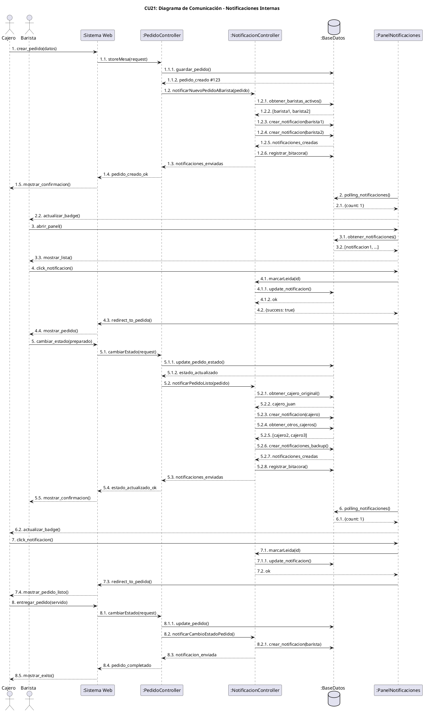
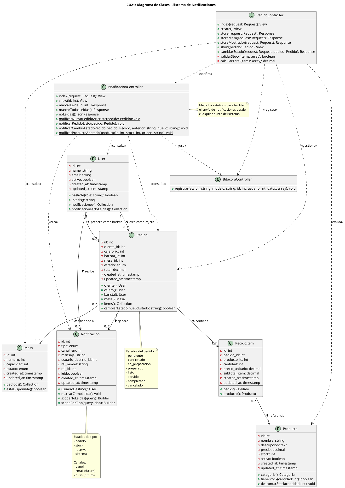

# Análisis Caso de Uso CU21: Notificaciones Internas

## Caso de Uso
**CU21. Notificaciones Internas (Barra ↔ Caja)**

---

## Propósito
Coordinar la comunicación en tiempo real entre el personal operativo (Cajero y Barista) durante el flujo de pedidos locales, garantizando que cada miembro del equipo sea notificado oportunamente sobre las acciones que debe realizar, reduciendo tiempos de espera y mejorando la eficiencia operativa.

---

## Actores
- **Cajero** (Actor Principal)
- **Barista** (Actor Principal)
- **Administrador** (Actor Secundario - visualización)
- **Sistema** (Actor Secundario - generador automático)

---

## Actor Iniciador
- **Cajero** (al crear un pedido)
- **Barista** (al cambiar estado del pedido)
- **Sistema** (al detectar cambios de estado)

---

## Pre-Condición
1. Usuario autenticado con rol `cajero` o `barista`
2. Sistema de notificaciones activo y funcional
3. Base de datos de notificaciones disponible
4. Usuarios destinatarios deben estar activos en el sistema
5. Para notificaciones de pedido: Pedido debe existir en estado válido

---

## Flujo de Proceso Principal

### **Flujo 1: Cajero Crea Pedido → Notifica a Barista**

1. El **Cajero** accede al módulo de "Pedidos"
2. Crea un nuevo pedido (mesa o mostrador) con productos seleccionados
3. Confirma el pedido
4. El **Sistema** guarda el pedido en la base de datos
5. El **Sistema** ejecuta `NotificacionController::notificarNuevoPedidoABarista()`
6. El **Sistema** obtiene la lista de todos los baristas activos
7. Para cada barista activo:
   - Crea una notificación con tipo `pedido`
   - Incluye información: ID pedido, cajero, ubicación, cantidad de productos
   - Marca la notificación como `no leída`
8. El **Sistema** registra el evento en la bitácora
9. El **Barista** ve la notificación en su panel (campana con badge rojo)
10. El **Barista** hace clic en la notificación para ver detalles
11. El **Barista** accede al pedido desde el link de la notificación

### **Flujo 2: Barista Completa Pedido → Notifica a Cajero**

1. El **Barista** accede a "Pedidos Barista"
2. Selecciona el pedido en preparación
3. Cambia el estado a "preparado" o "listo"
4. El **Sistema** actualiza el estado del pedido
5. El **Sistema** ejecuta `NotificacionController::notificarPedidoListo()`
6. El **Sistema** identifica al cajero que creó el pedido
7. Crea notificación prioritaria para el cajero original con información del barista
8. El **Sistema** obtiene lista de otros cajeros activos (backup)
9. Crea notificaciones secundarias para otros cajeros
10. El **Sistema** registra el evento en la bitácora
11. El **Cajero** recibe la notificación visual y sonora
12. El **Cajero** accede al pedido para entregarlo al cliente
13. El **Cajero** marca el pedido como "entregado"

### **Flujo 3: Notificación de Cambios de Estado**

1. Usuario autorizado cambia el estado de un pedido
2. El **Sistema** detecta el cambio de estado
3. El **Sistema** ejecuta `NotificacionController::notificarCambioEstadoPedido()`
4. El **Sistema** determina destinatarios según el nuevo estado:
   - `en_preparacion` → Notifica a baristas
   - `completado` → Notifica al barista que preparó
   - `cancelado` → Notifica a cajero y barista involucrados
5. El **Sistema** crea notificaciones correspondientes
6. El **Sistema** registra el evento en bitácora
7. Destinatarios reciben notificación en tiempo real

---

## Post-Condición

### **Éxito:**
- Notificación creada y almacenada en base de datos
- Notificación visible en panel del usuario destinatario
- Contador de notificaciones actualizado
- Evento registrado en bitácora del sistema
- Usuario puede acceder al recurso relacionado (pedido) desde la notificación

### **Falla:**
- Sistema registra error en logs
- Notificación no se envía pero el proceso continúa
- Se mantiene la integridad del pedido original

---

## Excepciones

### **E1: No hay baristas activos**
- **Condición:** Lista de baristas está vacía o ninguno está activo
- **Acción:** Sistema registra advertencia en logs, pedido se crea igualmente
- **Usuario:** Administrador recibe alerta de falta de personal

### **E2: Cajero original no disponible**
- **Condición:** Cajero que creó el pedido ya no está activo o fue eliminado
- **Acción:** Sistema notifica a todos los cajeros activos como backup
- **Usuario:** Cualquier cajero puede atender la entrega

### **E3: Pedido no existe**
- **Condición:** ID de pedido inválido o pedido fue eliminado
- **Acción:** Sistema no crea la notificación, registra error
- **Usuario:** No recibe notificación corrupta

### **E4: Usuario sin permisos**
- **Condición:** Usuario intenta acceder a notificación de otro usuario
- **Acción:** Sistema retorna error 403 Forbidden
- **Usuario:** Ve mensaje de acceso denegado

### **E5: Base de datos no disponible**
- **Condición:** Conexión a BD perdida durante creación de notificación
- **Acción:** Sistema reintenta 3 veces, luego registra error
- **Usuario:** No recibe notificación, pero operación principal (pedido) se mantiene

---

## Reglas de Negocio

### **RN1: Destinatarios por Tipo**
- **Nuevo Pedido:** Todos los baristas activos
- **Pedido Listo:** Cajero original + todos los cajeros/admins activos
- **Estado Cancelado:** Solo usuarios involucrados (cajero + barista)

### **RN2: Prioridad de Notificaciones**
- **Alta:** Pedido listo para entrega
- **Media:** Nuevo pedido para preparar
- **Baja:** Cambios de estado informativos

### **RN3: Auto-limpieza**
- Notificaciones marcadas como leídas se mantienen por 30 días
- Notificaciones no leídas se mantienen indefinidamente
- Sistema puede archivar notificaciones antiguas

### **RN4: Frecuencia de Actualización**
- Panel de notificaciones: Auto-actualización cada 45 segundos
- Polling ligero para no sobrecargar servidor
- Futuro: WebSockets para notificaciones instantáneas

---

## Atributos de Calidad

### **Disponibilidad**
- Sistema de notificaciones debe estar disponible 99.5% del tiempo
- Fallas en notificaciones no afectan operaciones críticas
- Mecanismo de reintentos automáticos

### **Performance**
- Creación de notificación < 200ms
- Actualización de contador < 100ms
- Carga de panel de notificaciones < 500ms
- Soporte para 100+ notificaciones simultáneas

### **Usabilidad**
- Notificaciones claras y concisas (< 100 caracteres)
- Iconos visuales para identificar tipo de notificación
- Acceso directo al recurso relacionado (1 clic)
- Panel no obstruye interfaz principal

### **Seguridad**
- Notificaciones solo visibles para destinatario autorizado
- Validación de permisos en cada acceso
- Encriptación de datos sensibles en tránsito

---

## Diagrama de Secuencia

```plantuml
@startuml
title CU21: Notificaciones Internas - Flujo Completo (Cajero → Barista → Cajero)

actor Cajero
actor Barista
participant "Sistema Web" as Sistema
participant "PedidoController" as PC
participant "NotificacionController" as NC
database "Base de Datos" as BD
participant "Panel Notificaciones" as Panel

== Fase 1: Cajero Crea Pedido ==
Cajero -> Sistema: Accede a crear pedido
activate Cajero
activate Sistema

Cajero -> Sistema: Completa formulario\n(productos, mesa, cliente)
Sistema -> PC: storeMesa($request)
activate PC

PC -> BD: Inicia transacción
activate BD
PC -> BD: Guarda pedido
PC -> BD: Guarda items del pedido
BD --> PC: Pedido creado #123
PC -> BD: Commit transacción
deactivate BD

PC -> NC: notificarNuevoPedidoABarista($pedido)
activate NC

NC -> BD: User::role('barista')\n->where('activo', true)->get()
activate BD
BD --> NC: Lista de baristas activos\n[María, Pedro]
deactivate BD

loop Para cada barista activo
    NC -> BD: Notificacion::create([\n  tipo: 'pedido',\n  mensaje: '🆕 Nuevo pedido #123...',\n  usuario_destino_id: barista_id\n])
    activate BD
    BD --> NC: Notificación creada
    deactivate BD
end

NC -> BD: BitacoraController::registrar()
activate BD
BD --> NC: Evento registrado
deactivate BD

NC --> PC: Notificaciones enviadas
deactivate NC

PC --> Sistema: Pedido creado exitosamente
deactivate PC
Sistema --> Cajero: Mensaje de éxito
deactivate Sistema

== Fase 2: Barista Recibe Notificación ==
Panel -> BD: Polling cada 45s\nGET /api/notificaciones/count
activate Panel
activate BD
BD --> Panel: {count: 1}
deactivate BD

Panel -> Panel: Actualiza badge (🔴 1)
Barista -> Panel: Clic en campana
activate Barista
Panel --> Barista: Abre panel lateral\nMuestra: "🆕 Nuevo pedido #123..."

Barista -> Panel: Clic en notificación
Panel -> NC: marcarLeida($notificacion_id)
activate NC
NC -> BD: UPDATE notificaciones\nSET leido = true
activate BD
BD --> NC: Notificación marcada
deactivate BD
NC --> Panel: {success: true}
deactivate NC

Panel -> Sistema: Redirige a barista.pedidos.index
deactivate Panel
Sistema --> Barista: Vista de pedidos pendientes

== Fase 3: Barista Prepara y Completa ==
Barista -> Sistema: Selecciona pedido #123
Sistema --> Barista: Muestra detalles del pedido

Barista -> Sistema: Cambia estado a "preparado"
Sistema -> PC: cambiarEstado($request, $pedido)
activate Sistema
activate PC

PC -> BD: UPDATE pedidos\nSET estado = 'preparado',\n    barista_id = auth()->id()
activate BD
BD --> PC: Estado actualizado
deactivate BD

alt Estado es 'preparado' o 'listo'
    PC -> NC: notificarPedidoListo($pedido)
    activate NC
    
    NC -> BD: User::find($pedido->cajero_id)
    activate BD
    BD --> NC: Cajero Juan (activo)
    deactivate BD
    
    NC -> BD: Notificacion::create([\n  mensaje: '✅ Pedido #123 listo...',\n  usuario_destino_id: juan_id\n])
    activate BD
    BD --> NC: Notificación creada
    deactivate BD
    
    NC -> BD: User::role(['cajero', 'administrador'])\n->where('activo', true)\n->where('id', '!=', juan_id)->get()
    activate BD
    BD --> NC: Otros cajeros [Ana, Luis]
    deactivate BD
    
    loop Para cada cajero backup
        NC -> BD: Notificacion::create([\n  mensaje: '🔔 Pedido #123 listo...'\n])
        activate BD
        BD --> NC: Notificación creada
        deactivate BD
    end
    
    NC -> BD: BitacoraController::registrar()
    activate BD
    BD --> NC: Evento registrado
    deactivate BD
    
    NC --> PC: Notificaciones enviadas
    deactivate NC
end

PC --> Sistema: Estado actualizado
deactivate PC
Sistema --> Barista: "Pedido marcado como listo"
deactivate Sistema
deactivate Barista

== Fase 4: Cajero Recibe y Entrega ==
Panel -> BD: Polling automático
activate Panel
activate BD
BD --> Panel: {count: 1}
deactivate BD

Panel -> Panel: Actualiza badge (🔴 1)\nMuestra notificación

Cajero -> Panel: Ve notificación\n"✅ Pedido #123 listo..."
activate Cajero
Cajero -> Panel: Clic en notificación
Panel -> NC: marcarLeida($notificacion_id)
activate NC
NC -> BD: UPDATE notificaciones
activate BD
BD --> NC: OK
deactivate BD
NC --> Panel: {success: true}
deactivate NC

Panel -> Sistema: Redirige a pedido #123
deactivate Panel
Sistema --> Cajero: Detalles del pedido listo

Cajero -> Sistema: Entrega pedido al cliente\nCambia estado a "servido"
Sistema -> PC: cambiarEstado($request, $pedido)
activate Sistema
activate PC

PC -> BD: UPDATE pedidos\nSET estado = 'servido'
activate BD
BD --> PC: Estado actualizado
deactivate BD

PC -> NC: notificarCambioEstadoPedido(\n  $pedido, 'preparado', 'servido'\n)
activate NC

NC -> BD: User::find($pedido->barista_id)
activate BD
BD --> NC: Barista María
deactivate BD

NC -> BD: Notificacion::create([\n  mensaje: '✅ Pedido #123 entregado...'\n])
activate BD
BD --> NC: Notificación creada
deactivate BD

NC --> PC: Notificación enviada
deactivate NC

PC --> Sistema: Pedido completado
deactivate PC
Sistema --> Cajero: "Pedido entregado exitosamente"
deactivate Sistema
deactivate Cajero

@enduml
```

---

## Diagrama de Comunicación

---

## Diagrama de Clases

---

## Matriz de Trazabilidad

| Requisito Funcional | Método Implementado | Clase | Prueba |
|---------------------|---------------------|-------|---------|
| RF01: Notificar nuevo pedido a baristas | `notificarNuevoPedidoABarista()` | NotificacionController | ✅ Manual |
| RF02: Notificar pedido listo a cajero | `notificarPedidoListo()` | NotificacionController | ✅ Manual |
| RF03: Notificar cambios de estado | `notificarCambioEstadoPedido()` | NotificacionController | ✅ Manual |
| RF04: Marcar notificación como leída | `marcarLeida()` | NotificacionController | ✅ Manual |
| RF05: Ver listado de notificaciones | `index()` | NotificacionController | ✅ Manual |
| RF06: Panel de notificaciones en sidebar | JavaScript | sidebar.blade.php | ✅ Manual |
| RF07: Contador de notificaciones no leídas | `noLeidas()` + JS | NotificacionController | ✅ Manual |
| RF08: Auto-actualización de notificaciones | JavaScript polling | sidebar.blade.php | ✅ Manual |
| RF09: Registrar eventos en bitácora | `registrar()` | BitacoraController | ✅ Manual |
| RF10: Validar permisos de acceso | `authorize()` | NotificacionController | ✅ Manual |

---

## Escenarios de Prueba

### **EP01: Flujo Completo Exitoso**
**Pre-condición:** Cajero y Barista activos en sistema

1. Cajero crea pedido para Mesa 5
2. Verificar notificación creada para baristas
3. Barista recibe notificación (badge actualizado)
4. Barista abre panel y ve notificación
5. Barista marca como leída y accede al pedido
6. Barista cambia estado a "preparado"
7. Verificar notificación creada para cajero
8. Cajero recibe notificación
9. Cajero accede al pedido y entrega
10. Verificar notificación de confirmación a barista

**Resultado esperado:** ✅ Todas las notificaciones creadas y entregadas correctamente

---

### **EP02: Sin Baristas Activos**
**Pre-condición:** Todos los baristas desactivados

1. Cajero intenta crear pedido
2. Sistema crea pedido exitosamente
3. Sistema intenta notificar (lista vacía)
4. Sistema registra advertencia en logs
5. Pedido queda en estado "pendiente"

**Resultado esperado:** ✅ Pedido creado, sin notificaciones, sin errores críticos

---

### **EP03: Cajero Original Inactivo**
**Pre-condición:** Barista marca pedido como listo, cajero original fue desactivado

1. Barista completa pedido
2. Sistema intenta notificar a cajero original (inactivo)
3. Sistema salta notificación principal
4. Sistema notifica a todos los cajeros backup
5. Otros cajeros reciben notificación

**Resultado esperado:** ✅ Notificaciones enviadas a cajeros backup, pedido no queda sin atender

---

### **EP04: Múltiples Notificaciones Simultáneas**
**Pre-condición:** 5 pedidos se crean al mismo tiempo

1. Sistema procesa 5 pedidos concurrentemente
2. Sistema crea 5 × N notificaciones (N = baristas activos)
3. Baristas reciben todas las notificaciones
4. Contador muestra "5" o "9+"
5. Panel lista todas las notificaciones

**Resultado esperado:** ✅ Todas las notificaciones creadas sin conflictos

---

### **EP05: Notificación con Pedido Eliminado**
**Pre-condición:** Pedido fue eliminado después de crear notificación

1. Usuario intenta acceder a notificación
2. Usuario hace clic en link del pedido
3. Sistema verifica existencia del pedido
4. Pedido no existe (404)
5. Sistema muestra mensaje de error amigable

**Resultado esperado:** ✅ Error manejado correctamente, sin crash del sistema

---

## Métricas de Éxito

| Métrica | Objetivo | Estado Actual |
|---------|----------|---------------|
| Tiempo de creación de notificación | < 200ms | ⏱️ A medir |
| Tiempo de actualización de contador | < 100ms | ⏱️ A medir |
| Tasa de entrega exitosa | > 99% | ⏱️ A medir |
| Notificaciones perdidas | < 1% | ⏱️ A medir |
| Satisfacción del usuario | > 4/5 | ⏱️ Pendiente encuesta |

---

## Cronograma de Implementación

| Fase | Actividad | Duración | Estado |
|------|-----------|----------|---------|
| 1 | Análisis y diseño | 2 horas | ✅ Completado |
| 2 | Implementación backend | 3 horas | ✅ Completado |
| 3 | Implementación frontend | 2 horas | ✅ Completado |
| 4 | Integración con pedidos | 1 hora | ✅ Completado |
| 5 | Pruebas unitarias | 2 horas | ⏳ Pendiente |
| 6 | Pruebas de integración | 2 horas | ⏳ Pendiente |
| 7 | Documentación | 1 hora | ✅ Completado |
| 8 | Despliegue a producción | 1 hora | ⏳ Pendiente |

**Total estimado:** 14 horas  
**Total ejecutado:** 9 horas  
**Pendiente:** 5 horas (pruebas y despliegue)

---

## Dependencias Técnicas

### **Backend (Laravel)**
- PHP 8.4.12
- Laravel 12.21.0
- Spatie Laravel-Permission (roles)
- MySQL 8.0+

### **Frontend**
- Alpine.js 3.x (reactividad)
- Tailwind CSS 3.x (estilos)
- JavaScript ES6+ (polling, animaciones)

### **Infraestructura**
- Servidor web (Apache/Nginx)
- Base de datos relacional
- Sistema de logs (Laravel Log)

---

## Glosario

| Término | Definición |
|---------|------------|
| **Polling** | Técnica de consulta periódica al servidor para obtener actualizaciones |
| **Badge** | Indicador visual (número) que muestra cantidad de notificaciones pendientes |
| **Sidebar** | Panel lateral deslizable que contiene las notificaciones |
| **Overlay** | Capa semitransparente que cubre el contenido y enfoca el panel |
| **Payload** | Datos incluidos en la notificación (tipo, mensaje, relaciones) |
| **Barista** | Usuario con rol de preparación de pedidos (barra/cocina) |
| **Cajero** | Usuario con rol de registro de pedidos y cobros |

---

## Referencias

- **Documento de Requisitos:** NOTIFICACIONES_INTERNAS.md
- **Código Fuente:** NotificacionController.php, PedidoController.php
- **Vista:** sidebar.blade.php
- **Bitácora:** BitacoraController.php
- **Modelo:** Notificacion.php, Pedido.php, User.php

---

**Fecha de análisis:** 2 de noviembre de 2025  
**Analista:** GitHub Copilot  
**Versión del documento:** 1.0  
**Estado:** Completado y listo para revisión
