# Diagrama de Clases - CU-15: Inventario de Producto Terminado

## Sistema de Cafetería/Pastelería

Este diagrama representa la estructura de clases para el caso de uso CU-15 que gestiona el inventario de productos terminados, incluyendo registro de producción, mermas, ajustes y reportes.

---

## Diagrama UML

```mermaid
classDiagram
    %% ============================================
    %% CAPA DE CONTROLADORES
    %% ============================================
    
    class InventarioProductoTerminadoController {
        <<Controller>>
        +index(Request) Response
        +show(id) Response
        +create() Response
        +store(Request) Response
        +createMerma(productoId) Response
        +storeMerma(Request, productoId) Response
        +createAjuste(productoId) Response
        +storeAjuste(Request, productoId) Response
        +reporteRotacion(Request) Response
        +exportar(Request) Response
        -generarAlertaStock(InventarioProducto, Producto) void
    }
    
    class BitacoraController {
        <<Controller>>
        +registrar(accion, modelo, id, datos, Request) void
    }
    
    %% ============================================
    %% CAPA DE MODELOS - ENTIDADES PRINCIPALES
    %% ============================================
    
    class InventarioProducto {
        <<Model>>
        -int id
        -int producto_id
        -int stock_actual
        -int stock_minimo
        -int punto_reposicion
        -string ubicacion
        --
        +producto() BelongsTo~Producto~
        +getEstadoStockAttribute() string
        +esCritico() bool
        +esBajo() bool
        +esOk() bool
        +requiereAlerta() bool
        +incrementarStock(cantidad) bool
        +decrementarStock(cantidad) bool
        +scopePorEstado(query, estado) Builder
        +scopeCriticos(query) Builder
        +scopeBajos(query) Builder
        +scopeConAlertas(query) Builder
    }
    
    class Producto {
        <<Model>>
        -int id
        -int categoria_id
        -string nombre
        -string tipo
        -string unidad
        -decimal precio
        -string imagen
        -bool activo
        -datetime created_at
        -datetime updated_at
        --
        +categoria() BelongsTo~Categoria~
        +inventario() HasOne~InventarioProducto~
        +pedidoItems() HasMany~PedidoItem~
        +especialVigente() HasOne~EspecialDelDia~
        +getStockActualAttribute() int
        +getEstadoStockAttribute() string
        +getPrecioVigenteAttribute() float
        +getTieneOfertaAttribute() bool
        +getPorcentajeOfertaAttribute() int
        +getAhorroOfertaAttribute() float
        +getImagenUrlAttribute() string
    }
    
    class Categoria {
        <<Model>>
        -int id
        -string nombre
        -datetime created_at
        -datetime updated_at
        --
        +productos() HasMany~Producto~
    }
    
    class User {
        <<Model>>
        -int id
        -string name
        -string email
        -string password
        -datetime email_verified_at
        -string temporal_token
        -bool password_set
        -datetime created_at
        -datetime updated_at
        --
        +roles() BelongsToMany~Role~
        +permissions() BelongsToMany~Permission~
        +notificaciones() HasMany~Notificacion~
        +initials() string
        +needsPasswordSetup() bool
        +isFullyActive() bool
        +hasPermissionTo(permission) bool
    }
    
    class Notificacion {
        <<Model>>
        -int id
        -string tipo
        -string canal
        -string mensaje
        -int usuario_destino_id
        -string rel_model
        -int rel_id
        -bool leido
        --
        +usuarioDestino() BelongsTo~User~
        +scopeNoLeidas(query) Builder
        +scopeParaUsuario(query, usuarioId) Builder
        +marcarComoLeida() void
    }
    
    %% ============================================
    %% CAPA DE SOLICITUDES (DTOs)
    %% ============================================
    
    class ProduccionRequest {
        <<DTO>>
        +int producto_id
        +int cantidad
        +string lote
        +date fecha_produccion
        +date fecha_vencimiento
        +string notas
        --
        +rules() array
        +messages() array
    }
    
    class MermaRequest {
        <<DTO>>
        +int cantidad
        +string motivo
        +string descripcion
        --
        +rules() array
        +messages() array
    }
    
    class AjusteRequest {
        <<DTO>>
        +int stock_nuevo
        +string motivo
        --
        +rules() array
        +messages() array
    }
    
    %% ============================================
    %% ENUMERACIONES
    %% ============================================
    
    class EstadoStock {
        <<enumeration>>
        OK
        BAJO
        CRÍTICO
    }
    
    class TipoProducto {
        <<enumeration>>
        terminado
        materia_prima
        insumo
    }
    
    class MotivoMerma {
        <<enumeration>>
        vencido
        dañado
        derramado
        calidad
        otro
    }
    
    class TipoMovimiento {
        <<enumeration>>
        ENTRADA
        SALIDA
        AJUSTE
        PRODUCCION
        MERMA
    }
    
    %% ============================================
    %% RELACIONES
    %% ============================================
    
    %% Controlador usa modelos
    InventarioProductoTerminadoController ..> InventarioProducto : usa
    InventarioProductoTerminadoController ..> Producto : usa
    InventarioProductoTerminadoController ..> Categoria : usa
    InventarioProductoTerminadoController ..> User : usa
    InventarioProductoTerminadoController ..> Notificacion : crea
    InventarioProductoTerminadoController ..> BitacoraController : registra
    
    %% Controlador recibe DTOs
    InventarioProductoTerminadoController ..> ProduccionRequest : recibe
    InventarioProductoTerminadoController ..> MermaRequest : recibe
    InventarioProductoTerminadoController ..> AjusteRequest : recibe
    
    %% Relaciones entre modelos
    InventarioProducto "1" --> "1" Producto : pertenece a
    Producto "1" --> "1" InventarioProducto : tiene
    Producto "*" --> "1" Categoria : pertenece a
    Categoria "1" --> "*" Producto : contiene
    
    Notificacion "*" --> "1" User : destinada a
    User "1" --> "*" Notificacion : recibe
    
    %% Uso de enumeraciones
    InventarioProducto ..> EstadoStock : calcula
    Producto ..> TipoProducto : clasifica
    MermaRequest ..> MotivoMerma : especifica
    ProduccionRequest ..> TipoMovimiento : registra
    
    %% ============================================
    %% NOTAS ADICIONALES
    %% ============================================
    
    note for InventarioProductoTerminadoController "Gestiona el ciclo completo del\ninventario de productos terminados:\n- Registro de producción\n- Control de mermas\n- Ajustes manuales\n- Reportes y alertas"
    
    note for InventarioProducto "Mantiene el estado actual del stock\ny calcula automáticamente alertas\nbasadas en umbrales configurables"
    
    note for Producto "Representa productos terminados\n(bebidas, postres, etc.) listos\npara venta al cliente"
```



---

## Descripción de Componentes

### 1. Capa de Controladores

#### InventarioProductoTerminadoController
Controlador principal del CU-15 que gestiona todas las operaciones relacionadas con el inventario de productos terminados:

- **index()**: Lista productos terminados con filtros (categoría, búsqueda, estado)
- **show()**: Muestra detalle de un producto terminado específico
- **create/store()**: Registra nueva producción de productos terminados
- **createMerma/storeMerma()**: Registra mermas o desperdicios
- **createAjuste/storeAjuste()**: Realiza ajustes manuales de inventario
- **reporteRotacion()**: Genera reporte de rotación de productos
- **exportar()**: Exporta reportes en PDF/Excel

#### BitacoraController
Registra todas las operaciones realizadas en el sistema para auditoría.

---

### 2. Capa de Modelos

#### InventarioProducto
Entidad central que mantiene el estado del inventario:
- **Atributos**: stock_actual, stock_minimo, punto_reposicion, ubicacion
- **Métodos de negocio**: 
  - Cálculo de estado (OK, BAJO, CRÍTICO)
  - Incremento/decremento de stock
  - Validación de alertas
- **Scopes**: Filtros por estado, críticos, bajos

#### Producto
Representa los productos terminados del sistema:
- **Tipo**: 'terminado' para productos listos para venta
- **Relaciones**: Categoría, Inventario, Items de pedido
- **Atributos calculados**: precio_vigente, stock_actual, estado_stock

#### Categoria
Agrupa productos por tipo (Bebidas, Postres, etc.)

#### User
Usuario del sistema con roles y permisos:
- Permisos relevantes: 'ver-inventario', 'editar-inventario'

#### Notificacion
Sistema de alertas para stock bajo o crítico

---

### 3. DTOs (Data Transfer Objects)

#### ProduccionRequest
Valida datos para registro de producción:
- producto_id, cantidad, lote, fechas, notas

#### MermaRequest
Valida datos para registro de mermas:
- cantidad, motivo (vencido, dañado, etc.), descripción

#### AjusteRequest
Valida datos para ajustes manuales:
- stock_nuevo, motivo del ajuste

---

### 4. Enumeraciones

#### EstadoStock
- **OK**: Stock por encima del mínimo
- **BAJO**: Stock entre 1 y stock_minimo
- **CRÍTICO**: Stock en 0 o negativo

#### TipoProducto
- **terminado**: Productos listos para venta
- **materia_prima**: Ingredientes base
- **insumo**: Materiales auxiliares

#### MotivoMerma
- **vencido**: Producto caducado
- **dañado**: Producto deteriorado
- **derramado**: Pérdida por accidente
- **calidad**: No cumple estándares
- **otro**: Otros motivos

#### TipoMovimiento
- **ENTRADA**: Incremento de stock
- **SALIDA**: Decremento de stock
- **AJUSTE**: Corrección manual
- **PRODUCCION**: Registro de producción
- **MERMA**: Registro de desperdicio

---

## Flujos Principales

### Flujo 1: Registro de Producción
```
Usuario → Controller.create() → Vista formulario
Usuario → Controller.store(ProduccionRequest) → Validación
→ InventarioProducto.incrementarStock() → Actualización BD
→ BitacoraController.registrar() → Auditoría
→ Redirección con mensaje éxito
```

### Flujo 2: Registro de Merma
```
Usuario → Controller.createMerma() → Vista formulario
Usuario → Controller.storeMerma(MermaRequest) → Validación
→ InventarioProducto.decrementarStock() → Actualización BD
→ BitacoraController.registrar() → Auditoría
→ Redirección con mensaje éxito
```

### Flujo 3: Generación de Alertas
```
InventarioProducto.save() → Verificación umbrales
→ InventarioProducto.requiereAlerta() → true
→ Controller.generarAlertaStock() → Creación Notificacion
→ User.permission('ver-inventario') → Usuarios destinatarios
→ Notificacion.create() → Alerta creada
```

### Flujo 4: Consulta de Inventario
```
Usuario → Controller.index(Request) → Aplicación filtros
→ InventarioProducto::with('producto.categoria') → Query Builder
→ Aplicación scopes (porEstado, búsqueda) → Filtrado
→ Paginación → Vista con resultados
→ BitacoraController.registrar() → Auditoría
```

---

## Permisos y Seguridad

### Permisos Requeridos
- **ver-inventario**: Consultar listados, detalles y reportes
- **editar-inventario**: Registrar producción, mermas y ajustes

### Triple Capa de Seguridad
1. **Middleware auth**: Usuario autenticado
2. **Middleware can**: Verificación de permisos
3. **Authorize en controller**: Validación adicional

---

## Patrones de Diseño Utilizados

1. **MVC (Model-View-Controller)**: Separación de responsabilidades
2. **Repository Pattern**: Eloquent ORM como capa de abstracción
3. **DTO Pattern**: Request classes para validación
4. **Observer Pattern**: Notificaciones automáticas
5. **Scope Pattern**: Filtros reutilizables en queries
6. **Factory Pattern**: Creación de modelos con factories

---

## Consideraciones Técnicas

### Base de Datos
- **inventario_productos**: Tabla principal de inventario
- **productos**: Catálogo de productos
- **categorias**: Clasificación de productos
- **notificaciones**: Sistema de alertas
- **users**: Usuarios del sistema

### Transacciones
Todas las operaciones de modificación de stock utilizan transacciones DB para garantizar integridad:
```php
DB::beginTransaction();
try {
    // Operaciones
    DB::commit();
} catch (\Exception $e) {
    DB::rollBack();
}
```

### Auditoría
Todas las operaciones se registran en bitácora con:
- Acción realizada
- Usuario responsable
- Datos antes/después
- Timestamp

---

## Extensibilidad

El diseño permite fácil extensión para:
- Nuevos tipos de movimientos de inventario
- Reportes adicionales
- Integración con sistemas externos
- Alertas por múltiples canales (email, SMS, push)
- Trazabilidad por lotes
- Control de fechas de vencimiento

---

**Fecha de creación**: 2025-11-22  
**Versión**: 1.0  
**Sistema**: Cafetería/Pastelería - Módulo de Inventario
