# Diagrama de Clases - CU-23: Historial de Pedidos del Cliente

## Sistema de Cafetería/Pastelería

Este diagrama representa la estructura de clases para el caso de uso CU-23 que gestiona el historial completo de pedidos de un cliente, incluyendo consultas, estadísticas, reorden y exportación.

---

## Diagrama UML

```mermaid
classDiagram
    %% ============================================
    %% CAPA DE CONTROLADORES
    %% ============================================
    
    class HistorialPedidosClienteController {
        <<Controller>>
        +index(Request) Response
        +show(id) Response
        +reordenar(id) Response
        +storeReorden(Request, id) Response
        +estadisticas() Response
        +exportar(Request) Response
        +buscar(Request) Response
        -calcularEstadisticas(clienteId) array
    }
    
    class BitacoraController {
        <<Controller>>
        +registrar(accion, modelo, id, datos, Request) void
    }
    
    %% ============================================
    %% CAPA DE MODELOS - ENTIDADES PRINCIPALES
    %% ============================================
    
    class Pedido {
        <<Model>>
        -int id
        -string tipo
        -int cliente_id
        -int atendido_por
        -int mesa_id
        -string modalidad
        -string estado
        -datetime programado_para
        -string direccion_entrega
        -decimal gps_lat
        -decimal gps_lng
        -string telefono_contacto
        -string canal
        -string notas
        -datetime created_at
        -datetime updated_at
        --
        +cliente() BelongsTo~User~
        +atendidoPor() BelongsTo~User~
        +mesa() BelongsTo~Mesa~
        +items() HasMany~PedidoItem~
        +cobros() HasMany~CobroCaja~
        +feedback() HasOne~Feedback~
        +getTotalAttribute() float
        +getTotalConPromocionesAttribute() float
        +calcularDescuentoPromociones() float
        +getPromocionesAplicadas() array
        +estaCobrado() bool
        +ultimoCobro() CobroCaja
        +listoParaCobrar() bool
        +esMesa() bool
        +esMostrador() bool
        +esWeb() bool
        +requiereEntrega() bool
        +scopeMesa(query) Builder
        +scopeMostrador(query) Builder
        +scopeWeb(query) Builder
        +scopePendiente(query) Builder
        +scopeEntregado(query) Builder
        +scopeAnulado(query) Builder
    }

    
    class PedidoItem {
        <<Model>>
        -int id
        -int pedido_id
        -int producto_id
        -int cantidad
        -decimal precio_unitario
        -decimal descuento_item
        -decimal subtotal_item
        -string estado_item
        -string destino
        -string notas
        -datetime created_at
        -datetime updated_at
        --
        +pedido() BelongsTo~Pedido~
        +producto() BelongsTo~Producto~
        +calcularSubtotal() float
        +getEstadoNombreAttribute() string
        +getDestinoNombreAttribute() string
        +scopePendiente(query) Builder
        +scopeEnviado(query) Builder
        +scopePreparado(query) Builder
        +scopeServido(query) Builder
        +scopeAnulado(query) Builder
        +scopeBarra(query) Builder
        +scopeCocina(query) Builder
    }
    
    class User {
        <<Model>>
        -int id
        -string name
        -string email
        -string password
        -datetime email_verified_at
        -string temporal_token
        -bool password_set
        -datetime created_at
        -datetime updated_at
        --
        +roles() BelongsToMany~Role~
        +permissions() BelongsToMany~Permission~
        +pedidosAtendidos() HasMany~Pedido~
        +misPedidos() HasMany~Pedido~
        +cobrosRealizados() HasMany~CobroCaja~
        +initials() string
        +hasRole(role) bool
        +hasPermissionTo(permission) bool
    }

    
    class Producto {
        <<Model>>
        -int id
        -int categoria_id
        -string nombre
        -string tipo
        -string unidad
        -decimal precio
        -string imagen
        -bool activo
        -datetime created_at
        -datetime updated_at
        --
        +categoria() BelongsTo~Categoria~
        +inventario() HasOne~InventarioProducto~
        +pedidoItems() HasMany~PedidoItem~
        +especialVigente() HasOne~EspecialDelDia~
        +getStockActualAttribute() int
        +getPrecioVigenteAttribute() float
        +getTieneOfertaAttribute() bool
        +getPorcentajeOfertaAttribute() int
        +getImagenUrlAttribute() string
    }
    
    class Categoria {
        <<Model>>
        -int id
        -string nombre
        -string destino
        -datetime created_at
        -datetime updated_at
        --
        +productos() HasMany~Producto~
    }
    
    class Mesa {
        <<Model>>
        -int id
        -string nombre
        -string estado
        -int fusion_id
        -int capacidad
        -datetime created_at
        -datetime updated_at
        --
        +pedidos() HasMany~Pedido~
        +fusionadas() HasMany~Mesa~
        +mesaFusionada() BelongsTo~Mesa~
    }

    
    class CobroCaja {
        <<Model>>
        -int id
        -int pedido_id
        -decimal importe
        -string metodo
        -string estado
        -string comprobante
        -int cajero_id
        -string qr_tx_id
        -string qr_estado
        -string qr_proveedor
        -string qr_referencia
        -datetime created_at
        -datetime updated_at
        --
        +pedido() BelongsTo~Pedido~
        +cajero() BelongsTo~User~
        +esEfectivo() bool
        +esPos() bool
        +esQr() bool
        +estaCobrado() bool
        +estaCancelado() bool
        +qrPendiente() bool
        +qrAprobado() bool
        +getNombreMetodoAttribute() string
        +scopeCobrados(query) Builder
        +scopePorMetodo(query, metodo) Builder
        +scopeDelDia(query) Builder
    }
    
    class Feedback {
        <<Model>>
        -int id
        -int pedido_id
        -int cliente_id
        -int calificacion
        -string comentario
        -datetime created_at
        -datetime updated_at
        --
        +pedido() BelongsTo~Pedido~
        +cliente() BelongsTo~User~
    }

    
    class InventarioProducto {
        <<Model>>
        -int id
        -int producto_id
        -int stock_actual
        -int stock_minimo
        -int punto_reposicion
        -string ubicacion
        --
        +producto() BelongsTo~Producto~
        +incrementarStock(cantidad) bool
        +decrementarStock(cantidad) bool
        +getEstadoStockAttribute() string
        +requiereAlerta() bool
    }
    
    %% ============================================
    %% ENUMERACIONES
    %% ============================================
    
    class TipoPedido {
        <<enumeration>>
        mesa
        mostrador
        web
    }
    
    class EstadoPedido {
        <<enumeration>>
        pendiente
        confirmado
        en_preparacion
        preparado
        en_reparto
        entregado
        servido
        retirado
        anulado
        cancelado
    }
    
    class EstadoItem {
        <<enumeration>>
        pendiente
        enviado
        preparado
        servido
        retirado
        entregado
        anulado
    }

    
    class MetodoPago {
        <<enumeration>>
        efectivo
        pos
        qr
    }
    
    class EstadoCobro {
        <<enumeration>>
        cobrado
        cancelado
    }
    
    class Modalidad {
        <<enumeration>>
        retiro
        entrega
    }
    
    %% ============================================
    %% DTOs Y VALUE OBJECTS
    %% ============================================
    
    class EstadisticasCliente {
        <<DTO>>
        +int total_pedidos
        +float total_gastado
        +float promedio_gasto
        +array pedidos_por_tipo
        +array pedidos_por_estado
        +Pedido ultimo_pedido
        +object producto_favorito
    }
    
    class ReordenRequest {
        <<DTO>>
        +array productos
        +string tipo
        +string modalidad
        +string direccion_entrega
        +string telefono_contacto
        +string notas
        --
        +rules() array
        +messages() array
    }

    
    class FiltrosHistorial {
        <<DTO>>
        +date fecha_desde
        +date fecha_hasta
        +string tipo
        +string estado
        +string buscar
    }
    
    %% ============================================
    %% RELACIONES
    %% ============================================
    
    %% Controlador usa modelos
    HistorialPedidosClienteController ..> Pedido : consulta
    HistorialPedidosClienteController ..> PedidoItem : crea
    HistorialPedidosClienteController ..> Producto : verifica
    HistorialPedidosClienteController ..> User : autentica
    HistorialPedidosClienteController ..> InventarioProducto : descuenta
    HistorialPedidosClienteController ..> BitacoraController : registra
    
    %% Controlador usa DTOs
    HistorialPedidosClienteController ..> EstadisticasCliente : genera
    HistorialPedidosClienteController ..> ReordenRequest : recibe
    HistorialPedidosClienteController ..> FiltrosHistorial : aplica
    
    %% Relaciones entre modelos principales
    Pedido "*" --> "1" User : cliente
    Pedido "*" --> "1" User : atendido por
    Pedido "*" --> "0..1" Mesa : asignada a
    Pedido "1" --> "*" PedidoItem : contiene
    Pedido "1" --> "*" CobroCaja : tiene
    Pedido "1" --> "0..1" Feedback : recibe
    
    PedidoItem "*" --> "1" Producto : referencia
    PedidoItem "*" --> "1" Pedido : pertenece a
    
    Producto "*" --> "1" Categoria : pertenece a
    Producto "1" --> "1" InventarioProducto : tiene
    
    CobroCaja "*" --> "1" Pedido : paga
    CobroCaja "*" --> "1" User : cajero
    
    Feedback "*" --> "1" Pedido : evalúa
    Feedback "*" --> "1" User : cliente
    
    Mesa "1" --> "*" Pedido : atiende

    
    %% Uso de enumeraciones
    Pedido ..> TipoPedido : clasifica
    Pedido ..> EstadoPedido : estado
    Pedido ..> Modalidad : modalidad
    PedidoItem ..> EstadoItem : estado
    CobroCaja ..> MetodoPago : método
    CobroCaja ..> EstadoCobro : estado
    
    %% ============================================
    %% NOTAS
    %% ============================================
    
    note for HistorialPedidosClienteController "Gestiona el historial completo\nde pedidos del cliente:\n- Consultas con filtros\n- Estadísticas personalizadas\n- Reorden de pedidos\n- Exportación de datos"
    
    note for Pedido "Entidad central que representa\nun pedido con todos sus estados,\nitems, cobros y relaciones"
    
    note for EstadisticasCliente "DTO que encapsula todas\nlas estadísticas calculadas\ndel cliente"
```



---

## Descripción de Componentes

### 1. Capa de Controladores

#### HistorialPedidosClienteController
Controlador principal del CU-23 que gestiona el historial de pedidos del cliente:

**Métodos públicos:**
- **index(Request)**: Lista historial con filtros (fechas, tipo, estado, búsqueda)
- **show(id)**: Muestra detalle completo de un pedido específico
- **reordenar(id)**: Formulario para reordenar un pedido anterior
- **storeReorden(Request, id)**: Procesa el reorden creando nuevo pedido
- **estadisticas()**: Dashboard con estadísticas del cliente
- **exportar(Request)**: Exporta historial en PDF/Excel/CSV
- **buscar(Request)**: Búsqueda avanzada en historial

**Métodos privados:**
- **calcularEstadisticas(clienteId)**: Calcula métricas del cliente

---

### 2. Capa de Modelos

#### Pedido
Entidad central que representa un pedido completo:


**Atributos principales:**
- tipo: mesa, mostrador, web
- estado: pendiente → entregado/servido
- cliente_id: usuario que realizó el pedido
- total: calculado desde items

**Relaciones:**
- Pertenece a un cliente (User)
- Atendido por un usuario (User)
- Puede tener una mesa asignada
- Contiene múltiples items
- Tiene cobros asociados
- Puede tener feedback

**Métodos de negocio:**
- Cálculo de totales con promociones
- Verificación de estado de cobro
- Validación de tipo de pedido

#### PedidoItem
Representa cada producto dentro de un pedido:

**Atributos:**
- cantidad, precio_unitario, descuento_item
- subtotal_item (calculado)
- estado_item: pendiente → entregado
- destino: barra o cocina

**Métodos:**
- Cálculo de subtotal
- Scopes por estado y destino

#### User
Usuario del sistema (cliente, cajero, admin):

**Roles relevantes:**
- Cliente: realiza pedidos
- Cajero: atiende pedidos
- Admin: acceso completo

**Relaciones con pedidos:**
- misPedidos(): Pedidos como cliente
- pedidosAtendidos(): Pedidos atendidos
- cobrosRealizados(): Cobros registrados

#### CobroCaja
Registro de pago de un pedido:

**Métodos de pago:**
- Efectivo
- POS (tarjeta)
- QR/Transferencia

**Estados:**
- cobrado, cancelado

**Validaciones:**
- Estado de pago QR
- Verificación de cobro completo

---

### 3. DTOs (Data Transfer Objects)

#### EstadisticasCliente
Encapsula todas las métricas del cliente:


```php
[
    'total_pedidos' => 45,
    'total_gastado' => 1250.50,
    'promedio_gasto' => 27.79,
    'pedidos_por_tipo' => ['mesa' => 20, 'mostrador' => 15, 'web' => 10],
    'pedidos_por_estado' => ['entregado' => 40, 'pendiente' => 3],
    'ultimo_pedido' => Pedido {...},
    'producto_favorito' => (object)['nombre' => 'Café', 'total' => 35],
]
```

#### ReordenRequest
Valida datos para reordenar un pedido:

**Reglas de validación:**
- productos: array requerido con producto_id, cantidad, notas
- tipo: mesa, mostrador o web
- modalidad: retiro o entrega (si es web)
- direccion_entrega: requerida si modalidad=entrega
- telefono_contacto: requerido

#### FiltrosHistorial
Encapsula filtros de búsqueda:
- Rango de fechas
- Tipo de pedido
- Estado
- Término de búsqueda

---

## Flujos Principales del CU-23

### Flujo 1: Consultar Historial
```
Cliente → Login → /cliente/historial
→ Controller.index(Request)
→ Aplicar filtros (fecha, tipo, estado, búsqueda)
→ Pedido::where('cliente_id', Auth::id())
→ Eager loading (items, productos, mesa)
→ Paginación (15 por página)
→ calcularEstadisticas(clienteId)
→ BitacoraController.registrar()
→ Vista con pedidos y estadísticas
```

### Flujo 2: Ver Detalle de Pedido
```
Cliente → Click en pedido → /cliente/historial/{id}
→ Controller.show(id)
→ Pedido::with(['items', 'cobros', 'feedback'])
→ Verificar propiedad (cliente_id === Auth::id())
→ getPromocionesAplicadas()
→ BitacoraController.registrar()
→ Vista detalle completo
```

### Flujo 3: Reordenar Pedido
```
Cliente → Historial → Reordenar → /cliente/historial/{id}/reordenar
→ Controller.reordenar(id)
→ Verificar propiedad del pedido
→ Foreach items: verificar disponibilidad
  → Producto activo?
  → Stock disponible?
→ Separar productos disponibles/no disponibles
→ Vista formulario reorden

Usuario ajusta cantidades → Submit
→ Controller.storeReorden(Request, id)
→ Validar datos
→ DB::beginTransaction()
→ Crear nuevo Pedido
→ Foreach productos:
  → Verificar stock
  → Crear PedidoItem
  → Aplicar precio_vigente (especiales)
  → InventarioProducto.decrementarStock()
→ Calcular total
→ BitacoraController.registrar()
→ DB::commit()
→ Redirect a detalle nuevo pedido
```


### Flujo 4: Ver Estadísticas
```
Cliente → Historial → Estadísticas
→ Controller.estadisticas()
→ calcularEstadisticas(clienteId)
  → Total pedidos (count)
  → Total gastado (sum)
  → Promedio gasto (avg)
  → Pedidos por tipo (group by)
  → Pedidos por estado (group by)
→ Productos más pedidos (TOP 10)
  → JOIN pedido_items + productos
  → GROUP BY producto
  → ORDER BY cantidad DESC
→ Pedidos por mes (últimos 12)
  → WHERE created_at >= 12 meses
  → GROUP BY mes
→ Gasto por categoría
  → JOIN categorías
  → GROUP BY categoría
→ BitacoraController.registrar()
→ Vista dashboard estadísticas
```

### Flujo 5: Exportar Historial
```
Cliente → Historial → Exportar
→ Selecciona formato (PDF/Excel/CSV)
→ Aplica filtros fecha (opcional)
→ Controller.exportar(Request)
→ Pedido::where('cliente_id', Auth::id())
→ Aplicar filtros fecha
→ Get all (sin paginación)
→ BitacoraController.registrar()
→ Generar archivo según formato
→ Download
```

### Flujo 6: Buscar en Historial
```
Cliente → Historial → Buscar
→ Ingresa término búsqueda
→ Controller.buscar(Request)
→ Validar término (min 1 char)
→ Pedido::where(function)
  → id LIKE %término%
  → OR items.producto.nombre LIKE %término%
  → OR notas LIKE %término%
→ Paginación resultados
→ BitacoraController.registrar()
→ Vista resultados búsqueda
```

---

## Seguridad y Permisos

### Permisos Implementados

**ver-mis-pedidos**
- Consultar historial propio
- Ver detalles de pedidos propios
- Ver estadísticas personales
- Buscar en historial
- Exportar historial

**crear-pedidos-web**
- Reordenar pedidos anteriores
- Crear nuevos pedidos web

### Validaciones de Seguridad

1. **Autenticación**: Middleware `auth` en todas las rutas
2. **Autorización**: Middleware `can:permiso` por operación
3. **Propiedad**: Validación en controller


```php
// Ejemplo de validación de propiedad
if ($pedido->cliente_id !== Auth::id()) {
    abort(403, 'No tienes permiso para ver este pedido.');
}
```

4. **Transacciones**: DB::transaction() en operaciones críticas
5. **Validación de datos**: Request validation en todos los inputs
6. **Sanitización**: Escape de datos en vistas

---

## Patrones de Diseño Utilizados

### 1. MVC (Model-View-Controller)
Separación clara de responsabilidades:
- **Model**: Lógica de negocio y persistencia
- **View**: Presentación (Blade templates)
- **Controller**: Coordinación y flujo

### 2. Repository Pattern
Eloquent ORM actúa como capa de abstracción de datos

### 3. DTO Pattern
- EstadisticasCliente
- ReordenRequest
- FiltrosHistorial

### 4. Eager Loading
Optimización de consultas N+1:
```php
Pedido::with(['items.producto', 'mesa', 'cobros'])
```

### 5. Scope Pattern
Filtros reutilizables en modelos:
```php
Pedido::mesa()->pendiente()->get()
```

### 6. Service Layer
PromocionService para cálculos complejos

### 7. Observer Pattern
Auditoría automática con BitacoraController

---

## Optimizaciones de Rendimiento

### Consultas Optimizadas

**Eager Loading:**
```php
Pedido::with([
    'items.producto.categoria',
    'mesa',
    'atendidoPor',
    'cobros.cajero'
])->get();
```

**Select específico:**
```php
Pedido::select('id', 'tipo', 'estado', 'total', 'created_at')
    ->where('cliente_id', $clienteId)
    ->get();
```

**Agregaciones en BD:**
```php
DB::table('pedidos')
    ->where('cliente_id', $clienteId)
    ->select(
        DB::raw('COUNT(*) as total_pedidos'),
        DB::raw('SUM(total) as total_gastado')
    )
    ->first();
```

### Paginación
- 15 pedidos por página
- Reduce carga de memoria
- Mejora tiempo de respuesta

### Índices Recomendados
```sql
CREATE INDEX idx_pedidos_cliente ON pedidos(cliente_id, created_at);
CREATE INDEX idx_pedidos_estado ON pedidos(estado);
CREATE INDEX idx_pedido_items_pedido ON pedido_items(pedido_id);
```

---

## Integración con Otros Módulos

### Inventario (CU15)
- Descuenta stock al reordenar
- Verifica disponibilidad de productos


### Promociones
- Aplica descuentos al reordenar
- Muestra promociones en detalle
- Calcula total con promociones

### Especiales del Día
- Aplica precios especiales vigentes
- Muestra descuentos en historial

### Cobros
- Muestra métodos de pago usados
- Estado de cobros (efectivo, POS, QR)
- Historial de transacciones

### Feedback
- Muestra valoraciones del cliente
- Permite ver comentarios anteriores

### Bitácora
- Registra todas las operaciones
- Auditoría completa de acciones

---

## Casos de Uso Relacionados

| CU | Nombre | Relación |
|----|--------|----------|
| CU01 | Gestión de Pedidos | Crea los pedidos que se consultan |
| CU15 | Inventario Producto Terminado | Verifica stock al reordenar |
| CU18 | Sistema de Promociones | Aplica descuentos en reorden |
| CU20 | Especiales del Día | Aplica precios especiales |
| CU22 | Feedback de Cliente | Muestra valoraciones |
| CU24 | Cobros en Caja | Muestra pagos realizados |

---

## Métricas y KPIs Calculados

### Métricas del Cliente
- **Total de pedidos**: COUNT(pedidos)
- **Total gastado**: SUM(pedidos.total)
- **Promedio de gasto**: AVG(pedidos.total)
- **Frecuencia**: Pedidos por mes
- **Ticket promedio**: Total gastado / Total pedidos

### Análisis de Comportamiento
- **Producto favorito**: Producto más pedido
- **Categoría preferida**: Categoría con más gasto
- **Canal preferido**: Mesa, mostrador o web
- **Horario preferido**: Análisis temporal
- **Tasa de reorden**: % de pedidos reordenados

### Métricas de Satisfacción
- **Calificación promedio**: AVG(feedback.calificacion)
- **Pedidos con feedback**: COUNT(feedback)
- **Tasa de cancelación**: % pedidos anulados

---

## Estructura de Base de Datos

### Tablas Principales

**pedidos**
```sql
id, tipo, cliente_id, atendido_por, mesa_id, 
modalidad, estado, total, telefono_contacto,
direccion_entrega, notas, created_at, updated_at
```

**pedido_items**
```sql
id, pedido_id, producto_id, cantidad, 
precio_unitario, descuento_item, subtotal_item,
estado_item, destino, notas, created_at, updated_at
```

**cobro_cajas**
```sql
id, pedido_id, importe, metodo, estado,
comprobante, cajero_id, qr_tx_id, qr_estado,
created_at, updated_at
```

### Relaciones Clave
- pedidos.cliente_id → users.id
- pedido_items.pedido_id → pedidos.id
- pedido_items.producto_id → productos.id
- cobro_cajas.pedido_id → pedidos.id

---

## Ejemplos de Consultas SQL

### Historial del cliente
```sql
SELECT p.*, u.name as cliente_nombre
FROM pedidos p
JOIN users u ON p.cliente_id = u.id
WHERE p.cliente_id = ?
ORDER BY p.created_at DESC
LIMIT 15 OFFSET 0;
```


### Productos más pedidos
```sql
SELECT 
    pr.nombre,
    SUM(pi.cantidad) as total_pedido,
    COUNT(DISTINCT p.id) as veces_pedido
FROM pedido_items pi
JOIN pedidos p ON pi.pedido_id = p.id
JOIN productos pr ON pi.producto_id = pr.id
WHERE p.cliente_id = ?
  AND p.estado NOT IN ('anulado', 'cancelado')
GROUP BY pr.id, pr.nombre
ORDER BY total_pedido DESC
LIMIT 10;
```

### Gasto por mes
```sql
SELECT 
    DATE_FORMAT(created_at, '%Y-%m') as mes,
    COUNT(*) as total_pedidos,
    SUM(total) as total_gastado
FROM pedidos
WHERE cliente_id = ?
  AND estado NOT IN ('anulado', 'cancelado')
  AND created_at >= DATE_SUB(NOW(), INTERVAL 12 MONTH)
GROUP BY mes
ORDER BY mes DESC;
```

### Estadísticas generales
```sql
SELECT 
    COUNT(*) as total_pedidos,
    SUM(total) as total_gastado,
    AVG(total) as promedio_gasto,
    SUM(CASE WHEN tipo = 'mesa' THEN 1 ELSE 0 END) as pedidos_mesa,
    SUM(CASE WHEN tipo = 'mostrador' THEN 1 ELSE 0 END) as pedidos_mostrador,
    SUM(CASE WHEN tipo = 'web' THEN 1 ELSE 0 END) as pedidos_web
FROM pedidos
WHERE cliente_id = ?
  AND estado NOT IN ('anulado', 'cancelado');
```

---

## Testing Recomendado

### Tests Unitarios
```php
// Cálculo de estadísticas
test('calcula estadísticas correctamente', function() {
    $cliente = User::factory()->create();
    Pedido::factory()->count(5)->create(['cliente_id' => $cliente->id]);
    
    $stats = $controller->calcularEstadisticas($cliente->id);
    
    expect($stats['total_pedidos'])->toBe(5);
});

// Validación de propiedad
test('cliente solo ve sus propios pedidos', function() {
    $cliente1 = User::factory()->create();
    $cliente2 = User::factory()->create();
    $pedido = Pedido::factory()->create(['cliente_id' => $cliente2->id]);
    
    actingAs($cliente1)
        ->get(route('cliente.historial.show', $pedido))
        ->assertStatus(403);
});
```

### Tests de Integración
```php
// Flujo completo de reorden
test('puede reordenar pedido anterior', function() {
    $cliente = User::factory()->create();
    $pedido = Pedido::factory()->create(['cliente_id' => $cliente->id]);
    
    actingAs($cliente)
        ->post(route('cliente.historial.store-reorden', $pedido), [
            'productos' => [...],
            'tipo' => 'web',
            'modalidad' => 'retiro',
            'telefono_contacto' => '555-1234'
        ])
        ->assertRedirect()
        ->assertSessionHas('success');
    
    expect(Pedido::count())->toBe(2);
});
```

### Tests de Rendimiento
```php
// Consulta optimizada
test('historial carga en menos de 500ms', function() {
    $cliente = User::factory()->create();
    Pedido::factory()->count(100)->create(['cliente_id' => $cliente->id]);
    
    $start = microtime(true);
    actingAs($cliente)->get(route('cliente.historial.index'));
    $duration = (microtime(true) - $start) * 1000;
    
    expect($duration)->toBeLessThan(500);
});
```

---

## Mejoras Futuras

### Funcionalidades
- [ ] Notificaciones push de cambios de estado
- [ ] Pedidos favoritos/guardados
- [ ] Programación de pedidos recurrentes
- [ ] Comparación de precios históricos
- [ ] Alertas de ofertas en productos favoritos
- [ ] Sistema de puntos/lealtad
- [ ] Compartir pedidos con otros usuarios
- [ ] Sugerencias basadas en historial (ML)

### Optimizaciones
- [ ] Cache de estadísticas (Redis)
- [ ] Índices compuestos en BD
- [ ] Lazy loading de imágenes
- [ ] Paginación infinita (scroll)
- [ ] Compresión de respuestas
- [ ] CDN para assets estáticos

### Reportes
- [ ] Exportación real a PDF con gráficos
- [ ] Excel con múltiples hojas
- [ ] Envío automático por email
- [ ] Reportes programados mensuales
- [ ] Dashboard interactivo con gráficos

---

**Fecha de creación:** 2025-11-22  
**Versión:** 1.0  
**Sistema:** Cafetería/Pastelería - Módulo de Historial de Pedidos  
**Estado:** Implementado (Controller y Rutas)
