# Diagrama de Clases - CU-25: Cumplimiento Sanitario (SENASAG)

## Sistema de Cafetería/Pastelería

Este diagrama representa la estructura de clases para el caso de uso CU-25 que gestiona el cumplimiento de normativas sanitarias SENASAG, incluyendo registro de limpieza, control de temperaturas y evidencias fotográficas.

---

## Diagrama UML

```mermaid
classDiagram
    %% ============================================
    %% CAPA DE CONTROLADORES
    %% ============================================
    
    class CumplimientoSanitarioController {
        <<Controller>>
        +index(Request) Response
        +createLimpieza() Response
        +storeLimpieza(Request) Response
        +showLimpieza(id) Response
        +createTemperatura() Response
        +storeTemperatura(Request) Response
        +showTemperatura(id) Response
        +historial(Request) Response
        +reporteSenasag(Request) Response
        +alertas() Response
        +exportar(Request) Response
        +eliminarEvidencia(id) Response
        -calcularEstadisticasDia(fecha) array
        -calcularEstadisticasPeriodo(inicio, fin) array
        -verificarAlertas(fecha) array
        -obtenerIncumplimientos(inicio, fin) array
        -verificarAreasSinLimpieza() array
        -generarAlertaTemperatura(registroId, datos) void
    }
    
    class BitacoraController {
        <<Controller>>
        +registrar(accion, modelo, id, datos, Request) void
    }

    
    %% ============================================
    %% CAPA DE MODELOS - ENTIDADES PRINCIPALES
    %% ============================================
    
    class RegistroLimpieza {
        <<Entity>>
        -int id
        -string area
        -string tipo_limpieza
        -string productos_usados
        -text observaciones
        -int responsable_id
        -date fecha_registro
        -time hora_registro
        -timestamp created_at
        -timestamp updated_at
        --
        +responsable() BelongsTo~User~
        +evidencias() HasMany~Evidencia~
        +getAreaNombreAttribute() string
        +getTipoNombreAttribute() string
        +getFechaHoraFormateadaAttribute() string
    }
    
    class RegistroTemperatura {
        <<Entity>>
        -int id
        -string equipo
        -decimal temperatura
        -decimal temperatura_minima
        -decimal temperatura_maxima
        -boolean fuera_rango
        -enum estado_equipo
        -text observaciones
        -int responsable_id
        -date fecha_registro
        -time hora_registro
        -timestamp created_at
        -timestamp updated_at
        --
        +responsable() BelongsTo~User~
        +evidencias() HasMany~Evidencia~
        +estaFueraRango() bool
        +esNormal() bool
        +esAlerta() bool
        +esCritico() bool
        +getEquipoNombreAttribute() string
        +getEstadoColorAttribute() string
        +getRangoPermitidoAttribute() string
        +getFechaHoraFormateadaAttribute() string
    }
    
    class Evidencia {
        <<Entity>>
        -int id
        -enum tipo_registro
        -int registro_id
        -string ruta_archivo
        -string nombre_original
        -timestamp created_at
        --
        +getUrlAttribute() string
        +getTamanoAttribute() string
        +esImagen() bool
        +eliminarArchivo() bool
    }

    
    class User {
        <<Model>>
        -int id
        -string name
        -string email
        -string password
        -datetime email_verified_at
        -datetime created_at
        -datetime updated_at
        --
        +roles() BelongsToMany~Role~
        +permissions() BelongsToMany~Permission~
        +registrosLimpieza() HasMany~RegistroLimpieza~
        +registrosTemperatura() HasMany~RegistroTemperatura~
        +notificaciones() HasMany~Notificacion~
        +hasRole(role) bool
        +hasPermissionTo(permission) bool
        +initials() string
    }
    
    class Notificacion {
        <<Model>>
        -int id
        -string tipo
        -string canal
        -string mensaje
        -int usuario_destino_id
        -string rel_model
        -int rel_id
        -bool leido
        --
        +usuarioDestino() BelongsTo~User~
        +marcarComoLeida() void
        +scopeNoLeidas(query) Builder
        +scopeParaUsuario(query, usuarioId) Builder
    }
    
    %% ============================================
    %% VALUE OBJECTS Y DTOs
    %% ============================================
    
    class RegistroLimpiezaRequest {
        <<DTO>>
        +string area
        +string tipo_limpieza
        +string productos_usados
        +string observaciones
        +array evidencias
        --
        +rules() array
        +messages() array
        +authorize() bool
    }
    
    class RegistroTemperaturaRequest {
        <<DTO>>
        +string equipo
        +float temperatura
        +float temperatura_minima
        +float temperatura_maxima
        +string estado_equipo
        +string observaciones
        +array evidencias
        --
        +rules() array
        +messages() array
        +authorize() bool
    }

    
    class ReporteSenasagRequest {
        <<DTO>>
        +date fecha_inicio
        +date fecha_fin
        +string tipo_reporte
        +string formato
        --
        +rules() array
        +messages() array
    }
    
    class EstadisticasDia {
        <<DTO>>
        +int total_limpiezas
        +int total_temperaturas
        +int temperaturas_alerta
        +int equipos_criticos
        +int areas_limpiadas
        +string cumplimiento_limpieza
        +string cumplimiento_temperatura
    }
    
    class EstadisticasPeriodo {
        <<DTO>>
        +int total_limpiezas
        +int total_temperaturas
        +int incumplimientos_temperatura
        +int dias_periodo
        +float promedio_limpiezas_dia
        +float promedio_temperaturas_dia
        +float tasa_cumplimiento
    }
    
    class Alerta {
        <<DTO>>
        +string tipo
        +string nivel
        +string mensaje
        +datetime fecha_hora
        +mixed datos_adicionales
    }
    
    class Incumplimiento {
        <<DTO>>
        +string tipo
        +date fecha
        +time hora
        +string detalle
        +string gravedad
        +string accion_correctiva
    }

    
    %% ============================================
    %% ENUMERACIONES
    %% ============================================
    
    class AreaLimpieza {
        <<enumeration>>
        cocina
        barra
        salon
        banos
        almacen
        refrigeradores
        equipos
        mesas
        pisos
        paredes
    }
    
    class TipoLimpieza {
        <<enumeration>>
        rutinaria
        profunda
        desinfeccion
        sanitizacion
    }
    
    class EquipoTemperatura {
        <<enumeration>>
        refrigerador_1
        refrigerador_2
        congelador_1
        vitrina_fria
        camara_fria
        barra_caliente
        horno
        plancha
    }
    
    class EstadoEquipo {
        <<enumeration>>
        normal
        alerta
        critico
    }
    
    class TipoRegistro {
        <<enumeration>>
        limpieza
        temperatura
    }
    
    class TipoReporte {
        <<enumeration>>
        completo
        limpieza
        temperatura
    }
    
    class FormatoExportacion {
        <<enumeration>>
        pdf
        excel
        csv
    }
    
    class NivelAlerta {
        <<enumeration>>
        info
        warning
        danger
    }

    
    %% ============================================
    %% SERVICIOS Y UTILIDADES
    %% ============================================
    
    class StorageService {
        <<Service>>
        +guardarEvidencia(archivo, tipo) string
        +eliminarEvidencia(ruta) bool
        +obtenerUrl(ruta) string
        +validarImagen(archivo) bool
        +comprimirImagen(archivo) archivo
    }
    
    class ReporteSenasagService {
        <<Service>>
        +generarReportePDF(datos, periodo) archivo
        +generarReporteExcel(datos, periodo) archivo
        +generarReporteCSV(datos, periodo) archivo
        +calcularEstadisticas(datos) array
        +identificarIncumplimientos(datos) array
    }
    
    class NotificacionService {
        <<Service>>
        +enviarAlertaTemperatura(registro, usuarios) void
        +enviarAlertaEquipoCritico(registro, usuarios) void
        +enviarRecordatorioLimpieza(areas, usuarios) void
        +obtenerUsuariosConPermiso(permiso) Collection
    }
    
    %% ============================================
    %% RELACIONES
    %% ============================================
    
    %% Controlador usa servicios
    CumplimientoSanitarioController ..> StorageService : usa
    CumplimientoSanitarioController ..> ReporteSenasagService : usa
    CumplimientoSanitarioController ..> NotificacionService : usa
    CumplimientoSanitarioController ..> BitacoraController : registra
    
    %% Controlador gestiona entidades
    CumplimientoSanitarioController ..> RegistroLimpieza : crea/consulta
    CumplimientoSanitarioController ..> RegistroTemperatura : crea/consulta
    CumplimientoSanitarioController ..> Evidencia : gestiona
    CumplimientoSanitarioController ..> Notificacion : crea
    
    %% Controlador usa DTOs
    CumplimientoSanitarioController ..> RegistroLimpiezaRequest : recibe
    CumplimientoSanitarioController ..> RegistroTemperaturaRequest : recibe
    CumplimientoSanitarioController ..> ReporteSenasagRequest : recibe
    CumplimientoSanitarioController ..> EstadisticasDia : genera
    CumplimientoSanitarioController ..> EstadisticasPeriodo : genera
    CumplimientoSanitarioController ..> Alerta : genera
    CumplimientoSanitarioController ..> Incumplimiento : identifica
    
    %% Relaciones entre entidades
    RegistroLimpieza "*" --> "1" User : responsable
    RegistroLimpieza "1" --> "*" Evidencia : tiene
    
    RegistroTemperatura "*" --> "1" User : responsable
    RegistroTemperatura "1" --> "*" Evidencia : tiene
    
    Evidencia "*" --> "1" RegistroLimpieza : pertenece a
    Evidencia "*" --> "1" RegistroTemperatura : pertenece a
    
    User "1" --> "*" RegistroLimpieza : registra
    User "1" --> "*" RegistroTemperatura : registra
    User "1" --> "*" Notificacion : recibe
    
    Notificacion "*" --> "1" User : destinada a
    Notificacion "*" --> "0..1" RegistroTemperatura : referencia

    
    %% Uso de enumeraciones
    RegistroLimpieza ..> AreaLimpieza : clasifica
    RegistroLimpieza ..> TipoLimpieza : tipo
    RegistroTemperatura ..> EquipoTemperatura : monitorea
    RegistroTemperatura ..> EstadoEquipo : estado
    Evidencia ..> TipoRegistro : clasifica
    ReporteSenasagRequest ..> TipoReporte : especifica
    ReporteSenasagRequest ..> FormatoExportacion : formato
    Alerta ..> NivelAlerta : nivel
    
    %% Servicios usan entidades
    StorageService ..> Evidencia : gestiona archivos
    ReporteSenasagService ..> RegistroLimpieza : procesa
    ReporteSenasagService ..> RegistroTemperatura : procesa
    NotificacionService ..> Notificacion : crea
    NotificacionService ..> User : notifica
    
    %% ============================================
    %% NOTAS
    %% ============================================
    
    note for CumplimientoSanitarioController "Gestiona el cumplimiento de\nnormativas sanitarias SENASAG:\n- Registro de limpieza\n- Control de temperaturas\n- Evidencias fotográficas\n- Reportes de auditoría\n- Sistema de alertas"
    
    note for RegistroTemperatura "Monitorea temperaturas de equipos\ny detecta automáticamente valores\nfuera de rango para generar alertas"
    
    note for Evidencia "Almacena evidencias fotográficas\nde actividades de limpieza y\ncontroles de temperatura"
    
    note for ReporteSenasagService "Genera reportes oficiales para\nauditorías SENASAG con estadísticas,\nincumplimientos y evidencias"
```



---

## Descripción de Componentes

### 1. Capa de Controladores

#### CumplimientoSanitarioController
Controlador principal del CU-25 que gestiona todas las operaciones de cumplimiento sanitario:

**Métodos públicos de gestión:**
- **index(Request)**: Dashboard con estadísticas del día y alertas activas
- **createLimpieza()**: Formulario para registrar actividad de limpieza
- **storeLimpieza(Request)**: Guarda registro de limpieza con evidencias
- **showLimpieza(id)**: Detalle completo de un registro de limpieza
- **createTemperatura()**: Formulario para registrar control de temperatura
- **storeTemperatura(Request)**: Guarda control de temperatura con alertas automáticas
- **showTemperatura(id)**: Detalle completo de un control de temperatura
- **historial(Request)**: Consulta histórica con filtros avanzados
- **reporteSenasag(Request)**: Genera reporte oficial para auditoría
- **alertas()**: Lista alertas activas de incumplimientos
- **exportar(Request)**: Exporta registros en PDF/Excel/CSV
- **eliminarEvidencia(id)**: Elimina evidencia fotográfica

**Métodos privados de cálculo:**
- **calcularEstadisticasDia(fecha)**: Métricas del día específico
- **calcularEstadisticasPeriodo(inicio, fin)**: Métricas de un período
- **verificarAlertas(fecha)**: Identifica alertas activas
- **obtenerIncumplimientos(inicio, fin)**: Lista incumplimientos del período
- **verificarAreasSinLimpieza()**: Áreas pendientes de limpieza
- **generarAlertaTemperatura(registroId, datos)**: Crea notificaciones de alerta

---

### 2. Capa de Entidades

#### RegistroLimpieza
Representa una actividad de limpieza registrada:

**Atributos principales:**
- area: Zona limpiada (cocina, barra, baños, etc.)
- tipo_limpieza: Tipo de actividad (rutinaria, profunda, desinfección)
- productos_usados: Productos químicos utilizados
- observaciones: Notas adicionales
- responsable_id: Usuario que realizó la limpieza
- fecha_registro, hora_registro: Timestamp del registro

**Relaciones:**
- Pertenece a un responsable (User)
- Tiene múltiples evidencias fotográficas

**Métodos:**
- Accessors para formateo de datos
- Relaciones con User y Evidencia

#### RegistroTemperatura
Representa un control de temperatura de equipo:

**Atributos principales:**
- equipo: Equipo monitoreado (refrigerador, congelador, etc.)
- temperatura: Valor registrado en °C
- temperatura_minima, temperatura_maxima: Rango permitido
- fuera_rango: Indicador booleano de incumplimiento
- estado_equipo: normal, alerta o crítico
- observaciones: Notas adicionales
- responsable_id: Usuario que realizó el control

**Métodos de negocio:**
- estaFueraRango(): Verifica si temperatura está fuera de rango
- esNormal(), esAlerta(), esCritico(): Estado del equipo
- Accessors para formateo y colores

**Lógica de alertas:**
- Genera alerta automática si fuera_rango = true
- Genera alerta crítica si estado_equipo = 'critico'
- Notifica a usuarios con permiso correspondiente

#### Evidencia
Almacena evidencias fotográficas de registros:

**Atributos:**
- tipo_registro: 'limpieza' o 'temperatura'
- registro_id: ID del registro asociado
- ruta_archivo: Path en storage
- nombre_original: Nombre del archivo subido

**Métodos:**
- getUrlAttribute(): URL pública del archivo
- getTamanoAttribute(): Tamaño del archivo
- esImagen(): Validación de tipo
- eliminarArchivo(): Elimina archivo físico

---

### 3. DTOs (Data Transfer Objects)

#### RegistroLimpiezaRequest
Valida datos de registro de limpieza:

**Reglas de validación:**
```php
'area' => 'required|string|max:100',
'tipo_limpieza' => 'required|string|max:50',
'productos_usados' => 'required|string|max:500',
'observaciones' => 'nullable|string|max:1000',
'evidencias.*' => 'nullable|image|mimes:jpeg,png,jpg|max:5120',
```

#### RegistroTemperaturaRequest
Valida datos de control de temperatura:

**Reglas de validación:**
```php
'equipo' => 'required|string|max:100',
'temperatura' => 'required|numeric|between:-50,300',
'temperatura_minima' => 'nullable|numeric|between:-50,300',
'temperatura_maxima' => 'nullable|numeric|between:-50,300',
'estado_equipo' => 'required|in:normal,alerta,critico',
'observaciones' => 'nullable|string|max:1000',
'evidencias.*' => 'nullable|image|mimes:jpeg,png,jpg|max:5120',
```

#### EstadisticasDia
Encapsula métricas del día:


```php
[
    'total_limpiezas' => 8,
    'total_temperaturas' => 12,
    'temperaturas_alerta' => 2,
    'equipos_criticos' => 1,
    'areas_limpiadas' => 7,
    'cumplimiento_limpieza' => 'completo', // >= 5 áreas
    'cumplimiento_temperatura' => 'completo', // >= 3 registros
]
```

#### EstadisticasPeriodo
Encapsula métricas de un período:

```php
[
    'total_limpiezas' => 240,
    'total_temperaturas' => 360,
    'incumplimientos_temperatura' => 15,
    'dias_periodo' => 30,
    'promedio_limpiezas_dia' => 8.0,
    'promedio_temperaturas_dia' => 12.0,
    'tasa_cumplimiento' => 95.83, // %
]
```

#### Alerta
Representa una alerta de incumplimiento:

```php
[
    'tipo' => 'temperatura',
    'nivel' => 'warning', // info, warning, danger
    'mensaje' => 'Hay 2 registro(s) de temperatura fuera de rango.',
    'fecha_hora' => '2025-11-22 14:30:00',
    'datos_adicionales' => [...],
]
```

#### Incumplimiento
Detalla un incumplimiento específico:

```php
[
    'tipo' => 'temperatura',
    'fecha' => '2025-11-22',
    'hora' => '14:30:00',
    'detalle' => 'Equipo: Refrigerador 1 - Temperatura: 8°C',
    'gravedad' => 'alta', // baja, media, alta, crítica
    'accion_correctiva' => 'Revisar termostato',
]
```

---

### 4. Servicios

#### StorageService
Gestiona almacenamiento de evidencias:

**Métodos:**
- **guardarEvidencia(archivo, tipo)**: Guarda archivo en storage/public
- **eliminarEvidencia(ruta)**: Elimina archivo físico
- **obtenerUrl(ruta)**: Genera URL pública
- **validarImagen(archivo)**: Valida tipo MIME
- **comprimirImagen(archivo)**: Optimiza tamaño (futuro)

#### ReporteSenasagService
Genera reportes oficiales:

**Métodos:**
- **generarReportePDF(datos, periodo)**: Reporte en PDF
- **generarReporteExcel(datos, periodo)**: Reporte en Excel
- **generarReporteCSV(datos, periodo)**: Reporte en CSV
- **calcularEstadisticas(datos)**: Procesa métricas
- **identificarIncumplimientos(datos)**: Detecta problemas

#### NotificacionService
Gestiona sistema de alertas:

**Métodos:**
- **enviarAlertaTemperatura(registro, usuarios)**: Alerta de temperatura
- **enviarAlertaEquipoCritico(registro, usuarios)**: Alerta crítica
- **enviarRecordatorioLimpieza(areas, usuarios)**: Recordatorio
- **obtenerUsuariosConPermiso(permiso)**: Lista destinatarios

---

## Flujos Principales del CU-25

### Flujo 1: Registro de Limpieza con Evidencias
```
Usuario → Login → Dashboard
→ "Registrar Limpieza"
→ Formulario (área, tipo, productos, observaciones)
→ Seleccionar evidencias fotográficas
→ Submit
→ Controller.storeLimpieza(Request)
→ Validar datos (RegistroLimpiezaRequest)
→ DB::beginTransaction()
→ Crear RegistroLimpieza
→ Foreach evidencias:
  → StorageService.guardarEvidencia()
  → Crear Evidencia en BD
→ BitacoraController.registrar()
→ DB::commit()
→ Redirect a dashboard con success
```

### Flujo 2: Control de Temperatura con Alertas
```
Usuario → Dashboard → "Registrar Temperatura"
→ Formulario (equipo, temperatura, rango, estado)
→ Submit
→ Controller.storeTemperatura(Request)
→ Validar datos (RegistroTemperaturaRequest)
→ Calcular fuera_rango:
  temperatura < min OR temperatura > max
→ DB::beginTransaction()
→ Crear RegistroTemperatura
→ Guardar evidencias (si hay)
→ ¿fuera_rango OR estado_critico?
  → SÍ:
    → generarAlertaTemperatura()
    → NotificacionService.obtenerUsuariosConPermiso()
    → Foreach usuario:
      → Crear Notificacion
    → Mensaje: warning
  → NO:
    → Mensaje: success
→ BitacoraController.registrar()
→ DB::commit()
→ Redirect con mensaje apropiado
```

### Flujo 3: Generación de Reporte SENASAG
```
Usuario → Dashboard → "Generar Reporte"
→ Formulario (fechas, tipo, formato)
→ Submit
→ Controller.reporteSenasag(Request)
→ Validar (ReporteSenasagRequest)
→ Consultar registros del período:
  → RegistroLimpieza::whereBetween()
  → RegistroTemperatura::whereBetween()
→ calcularEstadisticasPeriodo()
  → Total registros
  → Promedios
  → Tasa cumplimiento
→ obtenerIncumplimientos()
  → Temperaturas fuera de rango
  → Equipos críticos
→ ReporteSenasagService.generarReporte()
  → Según formato (PDF/Excel)
  → Incluir estadísticas
  → Incluir incumplimientos
  → Incluir evidencias
→ BitacoraController.registrar()
→ Download archivo
```

### Flujo 4: Sistema de Alertas Automáticas
```
RegistroTemperatura.save()
→ ¿fuera_rango = true OR estado = 'critico'?
→ SÍ:
  → generarAlertaTemperatura(registroId, datos)
  → Construir mensaje descriptivo
  → NotificacionService.obtenerUsuariosConPermiso('ver-cumplimiento-sanitario')
  → Foreach usuario:
    → Verificar notificación reciente (evitar spam)
    → Crear Notificacion:
      - tipo: 'alerta_sanitaria'
      - canal: 'panel'
      - mensaje: detalle del problema
      - usuario_destino_id
      - rel_model: 'cumplimiento_temperatura'
      - rel_id: registroId
      - leido: false
→ Usuario ve alerta en panel de notificaciones
→ Click en alerta → Ver detalle del registro
```

### Flujo 5: Consulta de Historial con Filtros
```
Usuario → Dashboard → "Ver Historial"
→ Seleccionar filtros:
  - Tipo: limpieza o temperatura
  - Rango de fechas
  - Área/Equipo específico
→ Submit
→ Controller.historial(Request)
→ Construir query según tipo:
  → Limpieza: whereBetween + where(area)
  → Temperatura: whereBetween + where(equipo)
→ Ordenar por fecha DESC
→ Paginar (20 por página)
→ BitacoraController.registrar()
→ Vista con resultados
→ Click en registro → Ver detalle
```

---

## Patrones de Diseño Utilizados

### 1. MVC (Model-View-Controller)
Separación clara de responsabilidades

### 2. Service Layer
- StorageService: Gestión de archivos
- ReporteSenasagService: Generación de reportes
- NotificacionService: Sistema de alertas

### 3. DTO Pattern
- Request classes para validación
- DTOs para estadísticas y alertas

### 4. Repository Pattern
Eloquent ORM como abstracción de datos

### 5. Observer Pattern
Sistema de notificaciones automáticas

### 6. Strategy Pattern
Diferentes estrategias de exportación (PDF, Excel, CSV)

### 7. Factory Pattern
Creación de alertas e incumplimientos

---

## Normativas SENASAG Implementadas

### Control de Temperaturas

**Refrigeración (0-4°C):**
- Refrigerador 1 (Lácteos)
- Refrigerador 2 (Carnes)
- Cámara fría

**Congelación (-18°C o menos):**
- Congelador 1

**Zona de peligro (5-60°C):**
- Evitar mantener alimentos en este rango
- Generar alerta si se detecta

**Alimentos calientes (>60°C):**
- Barra caliente
- Mantener temperatura adecuada

### Frecuencia de Limpieza

**Diaria:**
- Cocina
- Barra de café
- Salón comedor
- Baños
- Mesas y sillas
- Pisos

**Semanal:**
- Refrigeradores
- Equipos de cocina
- Paredes

**Mensual:**
- Limpieza profunda general
- Almacén

### Documentación Requerida

✅ **Implementado:**
- Registros diarios de temperatura
- Bitácora de limpieza y desinfección
- Evidencias fotográficas
- Identificación de responsables
- Fecha y hora de cada actividad

📋 **Generado en reportes:**
- Estadísticas de cumplimiento
- Incumplimientos detectados
- Acciones correctivas
- Trazabilidad completa

---

## Cálculos y Métricas

### Estadísticas del Día
```sql
SELECT 
    COUNT(*) as total_limpiezas,
    COUNT(DISTINCT area) as areas_limpiadas
FROM cumplimiento_limpieza
WHERE fecha_registro = ?;

SELECT 
    COUNT(*) as total_temperaturas,
    SUM(CASE WHEN fuera_rango = 1 THEN 1 ELSE 0 END) as temperaturas_alerta,
    SUM(CASE WHEN estado_equipo = 'critico' THEN 1 ELSE 0 END) as equipos_criticos
FROM cumplimiento_temperatura
WHERE fecha_registro = ?;
```

### Tasa de Cumplimiento
```php
$tasaCumplimiento = $totalTemperaturas > 0 
    ? (($totalTemperaturas - $incumplimientos) / $totalTemperaturas) * 100
    : 100;
```

### Promedio por Día
```php
$diasPeriodo = Carbon::parse($inicio)->diffInDays(Carbon::parse($fin)) + 1;
$promedioLimpiezas = $totalLimpiezas / $diasPeriodo;
$promedioTemperaturas = $totalTemperaturas / $diasPeriodo;
```

---

## Seguridad y Permisos

### Permisos Implementados

**ver-cumplimiento-sanitario:**
- Ver dashboard
- Consultar historial
- Ver detalles de registros
- Ver alertas

**registrar-cumplimiento-sanitario:**
- Registrar limpieza
- Registrar temperatura
- Subir evidencias
- Eliminar evidencias

**generar-reportes-sanitarios:**
- Generar reportes SENASAG
- Exportar datos
- Acceso a estadísticas completas

### Validaciones de Seguridad

1. **Autenticación**: Middleware auth
2. **Autorización**: Middleware can + authorize()
3. **Validación de archivos**: Tipo MIME, tamaño máximo
4. **Sanitización**: Escape de datos en vistas
5. **Transacciones**: DB::transaction() en operaciones críticas

---

## Estructura de Base de Datos

### Tabla: cumplimiento_limpieza
```sql
CREATE TABLE cumplimiento_limpieza (
    id BIGINT PRIMARY KEY AUTO_INCREMENT,
    area VARCHAR(100) NOT NULL,
    tipo_limpieza VARCHAR(50) NOT NULL,
    productos_usados VARCHAR(500) NOT NULL,
    observaciones TEXT,
    responsable_id BIGINT NOT NULL,
    fecha_registro DATE NOT NULL,
    hora_registro TIME NOT NULL,
    created_at TIMESTAMP DEFAULT CURRENT_TIMESTAMP,
    updated_at TIMESTAMP DEFAULT CURRENT_TIMESTAMP ON UPDATE CURRENT_TIMESTAMP,
    
    FOREIGN KEY (responsable_id) REFERENCES users(id) ON DELETE CASCADE,
    INDEX idx_fecha_area (fecha_registro, area),
    INDEX idx_responsable (responsable_id)
);
```

### Tabla: cumplimiento_temperatura
```sql
CREATE TABLE cumplimiento_temperatura (
    id BIGINT PRIMARY KEY AUTO_INCREMENT,
    equipo VARCHAR(100) NOT NULL,
    temperatura DECIMAL(5,2) NOT NULL,
    temperatura_minima DECIMAL(5,2),
    temperatura_maxima DECIMAL(5,2),
    fuera_rango BOOLEAN DEFAULT FALSE,
    estado_equipo ENUM('normal','alerta','critico') DEFAULT 'normal',
    observaciones TEXT,
    responsable_id BIGINT NOT NULL,
    fecha_registro DATE NOT NULL,
    hora_registro TIME NOT NULL,
    created_at TIMESTAMP DEFAULT CURRENT_TIMESTAMP,
    updated_at TIMESTAMP DEFAULT CURRENT_TIMESTAMP ON UPDATE CURRENT_TIMESTAMP,
    
    FOREIGN KEY (responsable_id) REFERENCES users(id) ON DELETE CASCADE,
    INDEX idx_fecha_equipo (fecha_registro, equipo),
    INDEX idx_fuera_rango (fuera_rango),
    INDEX idx_estado (estado_equipo),
    INDEX idx_responsable (responsable_id)
);
```

### Tabla: cumplimiento_evidencias
```sql
CREATE TABLE cumplimiento_evidencias (
    id BIGINT PRIMARY KEY AUTO_INCREMENT,
    tipo_registro ENUM('limpieza','temperatura') NOT NULL,
    registro_id BIGINT NOT NULL,
    ruta_archivo VARCHAR(500) NOT NULL,
    nombre_original VARCHAR(255) NOT NULL,
    created_at TIMESTAMP DEFAULT CURRENT_TIMESTAMP,
    
    INDEX idx_tipo_registro (tipo_registro, registro_id)
);
```

---

## Testing Recomendado

### Tests Unitarios
```php
// Cálculo de estadísticas
test('calcula estadísticas del día correctamente', function() {
    $fecha = '2025-11-22';
    RegistroLimpieza::factory()->count(5)->create(['fecha_registro' => $fecha]);
    RegistroTemperatura::factory()->count(3)->create(['fecha_registro' => $fecha]);
    
    $stats = $controller->calcularEstadisticasDia($fecha);
    
    expect($stats['total_limpiezas'])->toBe(5);
    expect($stats['total_temperaturas'])->toBe(3);
});

// Detección de temperatura fuera de rango
test('detecta temperatura fuera de rango', function() {
    $registro = RegistroTemperatura::create([
        'temperatura' => 10,
        'temperatura_minima' => 0,
        'temperatura_maxima' => 4,
        // ...
    ]);
    
    expect($registro->fuera_rango)->toBeTrue();
});
```

### Tests de Integración
```php
// Flujo completo de registro con alertas
test('genera alerta cuando temperatura está fuera de rango', function() {
    $user = User::factory()->create();
    $user->givePermissionTo('ver-cumplimiento-sanitario');
    
    actingAs($user)
        ->post(route('cumplimiento-sanitario.temperatura.store'), [
            'equipo' => 'refrigerador_1',
            'temperatura' => 10,
            'temperatura_minima' => 0,
            'temperatura_maxima' => 4,
            'estado_equipo' => 'alerta',
        ])
        ->assertRedirect()
        ->assertSessionHas('warning');
    
    expect(Notificacion::where('tipo', 'alerta_sanitaria')->count())->toBe(1);
});
```

---

## Mejoras Futuras

### Funcionalidades
- [ ] Integración con sensores IoT de temperatura
- [ ] Checklist digital interactivo
- [ ] Códigos QR para áreas y equipos
- [ ] Firma digital del responsable
- [ ] App móvil para registro rápido
- [ ] Dashboard en tiempo real
- [ ] Análisis predictivo de fallas
- [ ] Recordatorios automáticos programados

### Reportes
- [ ] Gráficos de tendencias
- [ ] Mapas de calor de limpieza
- [ ] Comparativas mensuales/anuales
- [ ] Alertas por email/SMS
- [ ] Integración con sistema de mantenimiento

### Optimizaciones
- [ ] Compresión automática de imágenes
- [ ] Almacenamiento en la nube (S3)
- [ ] Cache de estadísticas (Redis)
- [ ] Exportación asíncrona con colas
- [ ] OCR para lectura de termómetros

---

**Fecha de creación:** 2025-11-22  
**Versión:** 1.0  
**Sistema:** Cafetería/Pastelería - Módulo de Cumplimiento Sanitario SENASAG  
**Estado:** Implementado (Controller, Rutas y Migración)
