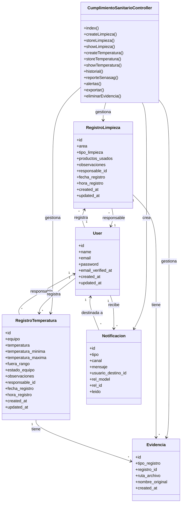

# Diagrama de Clases - CU25: Cumplimiento Sanitario (SENASAG)

## Diagrama UML Simplificado



---

## Descripción de Clases

### CumplimientoSanitarioController
**Responsabilidad:** Gestionar registros de cumplimiento sanitario SENASAG

**Métodos principales:**
- `index()` - Dashboard con estadísticas del día
- `createLimpieza()` / `storeLimpieza()` - Registrar actividades de limpieza
- `createTemperatura()` / `storeTemperatura()` - Registrar control de temperaturas
- `historial()` - Consultar registros históricos
- `reporteSenasag()` - Generar reportes oficiales
- `alertas()` - Ver alertas de incumplimientos
- `exportar()` - Exportar datos (PDF/Excel/CSV)

---

### RegistroLimpieza
**Responsabilidad:** Almacenar actividades de limpieza y desinfección

**Atributos clave:**
- `area` - Zona limpiada (cocina, barra, baños, etc.)
- `tipo_limpieza` - Tipo (rutinaria, profunda, desinfección)
- `productos_usados` - Productos químicos utilizados
- `responsable_id` - Usuario que realizó la limpieza
- `fecha_registro` / `hora_registro` - Timestamp del registro

**Relaciones:**
- Pertenece a un User (responsable)
- Tiene múltiples Evidencias fotográficas

---

### RegistroTemperatura
**Responsabilidad:** Almacenar controles de temperatura de equipos

**Atributos clave:**
- `equipo` - Equipo monitoreado (refrigerador, congelador, etc.)
- `temperatura` - Valor registrado en °C
- `temperatura_minima` / `temperatura_maxima` - Rango permitido
- `fuera_rango` - Indicador de incumplimiento (boolean)
- `estado_equipo` - Estado: normal, alerta, crítico
- `responsable_id` - Usuario que realizó el control

**Relaciones:**
- Pertenece a un User (responsable)
- Tiene múltiples Evidencias fotográficas
- Genera Notificaciones si está fuera de rango

---

### Evidencia
**Responsabilidad:** Almacenar evidencias fotográficas de registros

**Atributos:**
- `tipo_registro` - 'limpieza' o 'temperatura'
- `registro_id` - ID del registro asociado
- `ruta_archivo` - Path en storage/public
- `nombre_original` - Nombre del archivo subido

**Relaciones:**
- Pertenece a RegistroLimpieza o RegistroTemperatura

---

### User
**Responsabilidad:** Usuarios del sistema

**Relaciones con CU25:**
- Registra actividades de limpieza
- Registra controles de temperatura
- Recibe notificaciones de alertas sanitarias

---

### Notificacion
**Responsabilidad:** Alertas de incumplimientos sanitarios

**Atributos clave:**
- `tipo` - 'alerta_sanitaria'
- `mensaje` - Descripción del problema
- `usuario_destino_id` - Usuario que recibe la alerta
- `rel_model` / `rel_id` - Referencia al registro que generó la alerta
- `leido` - Estado de lectura

**Cuándo se genera:**
- Temperatura fuera de rango
- Equipo en estado crítico
- Áreas sin limpieza (recordatorio)

---

## Flujo Principal: Registro de Temperatura con Alerta

```
1. Usuario → createTemperatura()
2. Formulario: equipo, temperatura, rango
3. Submit → storeTemperatura()
4. Validar datos
5. Crear RegistroTemperatura
6. ¿Temperatura fuera de rango?
   → SÍ: Crear Notificacion para usuarios autorizados
   → NO: Continuar
7. Guardar evidencias (si hay)
8. Redirect con mensaje
```

---

## Tablas de Base de Datos

### cumplimiento_limpieza
```
id, area, tipo_limpieza, productos_usados, observaciones,
responsable_id, fecha_registro, hora_registro, created_at, updated_at
```

### cumplimiento_temperatura
```
id, equipo, temperatura, temperatura_minima, temperatura_maxima,
fuera_rango, estado_equipo, observaciones, responsable_id,
fecha_registro, hora_registro, created_at, updated_at
```

### cumplimiento_evidencias
```
id, tipo_registro, registro_id, ruta_archivo, nombre_original, created_at
```

---

## Permisos

- `ver-cumplimiento-sanitario` - Ver registros y alertas
- `registrar-cumplimiento-sanitario` - Crear registros y evidencias
- `generar-reportes-sanitarios` - Generar reportes SENASAG

---

**Sistema:** Cafetería/Pastelería - Cumplimiento Sanitario SENASAG  
**Versión:** 1.0 - Simplificado
